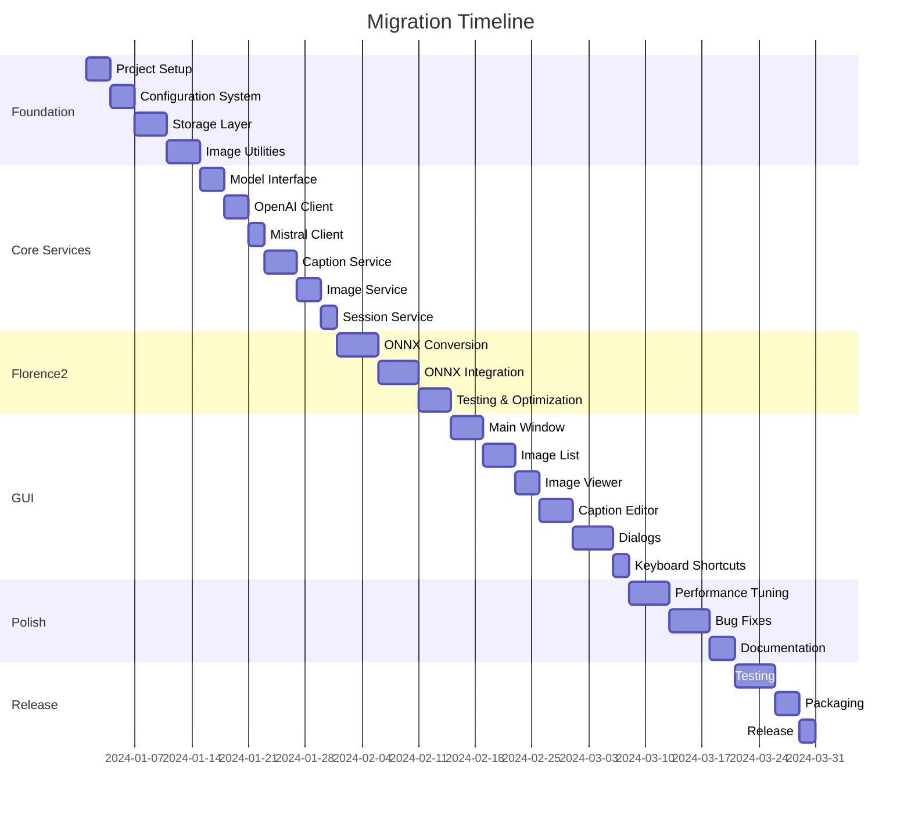

# Python to Go Migration Plan: Yofardev Captioner

## Executive Summary

This document outlines a comprehensive migration plan for converting the Yofardev Captioner application from Python to Go. The migration will maintain all existing functionality while leveraging Go's performance benefits, strong typing, and excellent concurrency support.

**Target Architecture:**
- Native GUI using Fyne framework
- All existing AI model integrations (Florence2, GPT-4, Pixtral, Gemini, Qwen2, Grok)
- Local ML model support via ONNX Runtime
- Complete rewrite following Go best practices and idioms

---

## Table of Contents

1. [Current Architecture Analysis](#1-current-architecture-analysis)
2. [Technology Stack Mapping](#2-technology-stack-mapping)
3. [Project Structure](#3-project-structure)
4. [Migration Phases](#4-migration-phases)
5. [Detailed Component Migration](#5-detailed-component-migration)
6. [Challenges and Solutions](#6-challenges-and-solutions)
7. [Testing Strategy](#7-testing-strategy)
8. [Performance Considerations](#8-performance-considerations)
9. [Timeline and Milestones](#9-timeline-and-milestones)
10. [Risk Assessment](#10-risk-assessment)

---

## 1. Current Architecture Analysis

### 1.1 Application Overview

The Yofardev Captioner is a desktop application that helps users generate captions for images using various AI vision models. It provides:

- Image browsing and management
- Multiple AI model integration (local and API-based)
- Caption editing and batch processing
- Session persistence
- Search and replace functionality

### 1.2 Current Python Components

```
yofardev-captioner/
├── main.py                 # Application entry point
├── vision_service.py       # AI model orchestration
├── florence2.py           # Local Florence2 model integration
├── open_ai.py             # OpenAI-compatible API client
├── pixtral.py             # Mistral Pixtral integration
├── settings.py            # API key management
├── session_file.py        # Session persistence
├── utils.py               # Utility functions
├── thumbnail.py           # Custom thumbnail widget
├── rename_images.py       # File renaming utility
└── ui/
    ├── main_window.py     # Main application window
    ├── caption_editor.py  # Text editing component
    ├── image_manager.py   # Image operations
    ├── model_controls.py  # Model selection UI
    ├── prompt_dialog.py   # Prompt editing dialog
    └── search_replace_dialog.py  # Search/replace UI
```

### 1.3 Key Dependencies

| Python Library | Purpose | Lines of Code |
|---------------|---------|---------------|
| tkinter | GUI framework | ~800 |
| PIL/Pillow | Image processing | ~200 |
| torch | PyTorch for Florence2 | ~100 |
| transformers | Hugging Face models | ~100 |
| openai | OpenAI API client | ~40 |
| mistralai | Mistral API client | ~25 |
| python-dotenv | Environment variables | ~20 |

**Total Estimated LOC:** ~1,500 lines

---

## 2. Technology Stack Mapping

### 2.1 Core Libraries

| Python | Go Equivalent | Purpose | Notes |
|--------|---------------|---------|-------|
| tkinter | [Fyne](https://fyne.io/) | GUI framework | Modern, cross-platform, native look |
| Pillow | [imaging](https://github.com/disintegration/imaging) | Image processing | Pure Go, excellent performance |
| torch | [onnxruntime-go](https://github.com/yalue/onnxruntime_go) | ML inference | Requires ONNX model conversion |
| transformers | Custom implementation | Model loading | Need to implement model download/cache |
| openai | [go-openai](https://github.com/sashabaranov/go-openai) | OpenAI API | Well-maintained, feature-complete |
| mistralai | Custom HTTP client | Mistral API | Simple REST API, easy to implement |
| python-dotenv | [godotenv](https://github.com/joho/godotenv) | Environment variables | Drop-in replacement |

### 2.2 Additional Go Libraries

| Library | Purpose | Justification |
|---------|---------|---------------|
| [viper](https://github.com/spf13/viper) | Configuration management | Better than godotenv for complex config |
| [logrus](https://github.com/sirupsen/logrus) | Structured logging | Production-ready logging |
| [testify](https://github.com/stretchr/testify) | Testing framework | Assertions and mocking |
| [go-sqlite3](https://github.com/mattn/go-sqlite3) | Session storage | Better than JSON for persistence |
| [resty](https://github.com/go-resty/resty) | HTTP client | Simplified API calls |

---

## 3. Project Structure

### 3.1 Proposed Go Project Layout

```
yofardev-captioner-go/
├── cmd/
│   └── captioner/
│       └── main.go                 # Application entry point
├── internal/
│   ├── app/
│   │   └── app.go                  # Application orchestration
│   ├── config/
│   │   ├── config.go               # Configuration management
│   │   └── settings.go             # User settings
│   ├── models/
│   │   ├── model.go                # Model interface
│   │   ├── florence2.go            # Florence2 implementation
│   │   ├── openai.go               # OpenAI-compatible client
│   │   ├── mistral.go              # Mistral client
│   │   └── registry.go             # Model registry
│   ├── services/
│   │   ├── caption.go              # Caption generation service
│   │   ├── image.go                # Image processing service
│   │   └── session.go              # Session management
│   ├── storage/
│   │   ├── storage.go              # Storage interface
│   │   └── sqlite.go               # SQLite implementation
│   └── ui/
│       ├── app.go                  # Main window
│       ├── components/
│       │   ├── image_list.go       # Image list widget
│       │   ├── image_viewer.go     # Image display
│       │   ├── caption_editor.go   # Text editor
│       │   ├── model_selector.go   # Model dropdown
│       │   └── toolbar.go          # Toolbar buttons
│       └── dialogs/
│           ├── settings.go         # Settings dialog
│           ├── prompt.go           # Prompt editor
│           └── search_replace.go   # Search/replace dialog
├── pkg/
│   ├── imageutil/
│   │   ├── resize.go               # Image resizing
│   │   ├── thumbnail.go            # Thumbnail generation
│   │   └── encode.go               # Base64 encoding
│   └── fileutil/
│       ├── sort.go                 # File sorting
│       └── rename.go               # Batch renaming
├── assets/
│   ├── icons/                      # Application icons
│   └── models/                     # Cached ML models
├── configs/
│   └── default.yaml                # Default configuration
├── scripts/
│   ├── build.sh                    # Build script
│   └── download_models.sh          # Model download script
├── go.mod
├── go.sum
├── README.md
├── LICENSE
└── .env.example
```

### 3.2 Package Responsibilities

#### `cmd/captioner`
- Application entry point
- Command-line argument parsing
- Initialization and startup

#### `internal/app`
- Application lifecycle management
- Component coordination
- Event handling

#### `internal/config`
- Configuration loading and validation
- Environment variable management
- Settings persistence

#### `internal/models`
- AI model interface definition
- Model-specific implementations
- Model registry and factory

#### `internal/services`
- Business logic layer
- Caption generation orchestration
- Image processing operations
- Session state management

#### `internal/storage`
- Data persistence abstraction
- SQLite implementation
- Migration management

#### `internal/ui`
- Fyne-based GUI components
- Event handlers
- Layout management

#### `pkg/`
- Reusable utility packages
- Image processing utilities
- File operations

---

## 4. Migration Phases

### Phase 1: Foundation (Week 1-2)

**Goal:** Set up project structure and core infrastructure

**Tasks:**
1. Initialize Go module and project structure
2. Set up configuration management (Viper)
3. Implement logging infrastructure (Logrus)
4. Create storage layer with SQLite
5. Set up testing framework
6. Implement basic image utilities

**Deliverables:**
- Working project skeleton
- Configuration system
- Storage layer with tests
- Image processing utilities

**Success Criteria:**
- All tests passing
- Configuration loads from file and environment
- Images can be loaded and processed

---

### Phase 2: Core Services (Week 3-4)

**Goal:** Implement business logic without UI

**Tasks:**
1. Implement model interface and registry
2. Create OpenAI-compatible API client
3. Implement Mistral API client
4. Create caption generation service
5. Implement image management service
6. Add session management
7. Write comprehensive tests

**Deliverables:**
- Working API clients for all models (except Florence2)
- Caption generation service
- Image management service
- Session persistence

**Success Criteria:**
- Can generate captions via API models
- Images can be loaded and managed
- Sessions persist across restarts
- 80%+ test coverage

---

### Phase 3: Florence2 Integration (Week 5-6)

**Goal:** Add local ML model support

**Tasks:**
1. Convert Florence2 model to ONNX format
2. Integrate ONNX Runtime Go bindings
3. Implement model download and caching
4. Create Florence2 service
5. Add preprocessing and postprocessing
6. Performance optimization
7. Testing with various image types

**Deliverables:**
- Working Florence2 integration
- Model download and caching system
- Performance benchmarks

**Success Criteria:**
- Florence2 generates captions locally
- Model downloads automatically on first use
- Performance comparable to Python version
- Memory usage is acceptable

**Challenges:**
- ONNX conversion may require model adjustments
- Go ONNX bindings are less mature than Python
- May need to implement custom preprocessing

---

### Phase 4: GUI Implementation (Week 7-9)

**Goal:** Build complete Fyne-based UI

**Tasks:**
1. Create main window layout
2. Implement image list with thumbnails
3. Build image viewer component
4. Create caption editor with undo/redo
5. Implement model selector
6. Build toolbar with all actions
7. Create settings dialog
8. Implement prompt editor dialog
9. Build search/replace dialog
10. Add keyboard shortcuts
11. Implement drag-and-drop support

**Deliverables:**
- Complete GUI matching Python version functionality
- All dialogs and components
- Keyboard shortcuts
- Responsive layout

**Success Criteria:**
- All features from Python version work
- UI is responsive and intuitive
- Keyboard shortcuts function correctly
- Application feels native on macOS

---

### Phase 5: Polish and Optimization (Week 10-11)

**Goal:** Refine user experience and performance

**Tasks:**
1. Performance profiling and optimization
2. Memory leak detection and fixes
3. Error handling improvements
4. Loading indicators and progress bars
5. Batch processing optimization
6. UI/UX refinements
7. Documentation
8. Build and packaging scripts

**Deliverables:**
- Optimized application
- Complete documentation
- Build scripts for all platforms
- Installation guide

**Success Criteria:**
- Application starts in < 2 seconds
- Image loading is smooth
- Batch processing is efficient
- No memory leaks
- Professional documentation

---

### Phase 6: Testing and Release (Week 12)

**Goal:** Comprehensive testing and first release

**Tasks:**
1. End-to-end testing
2. Cross-platform testing (macOS, Linux, Windows)
3. User acceptance testing
4. Bug fixes
5. Release preparation
6. Create installers/packages
7. Write release notes

**Deliverables:**
- Tested application on all platforms
- Installation packages
- Release notes
- Migration guide from Python version

**Success Criteria:**
- All critical bugs fixed
- Application works on macOS, Linux, Windows
- Installation is straightforward
- Users can migrate from Python version

---

## 5. Detailed Component Migration

### 5.1 Main Application Entry Point

**Python (`main.py`):**
```python
import tkinter as tk
from ui import Captioner

def main():
    root = tk.Tk()
    Captioner(root)
    root.mainloop()

if __name__ == "__main__":
    main()
```

**Go (`cmd/captioner/main.go`):**
```go
package main

import (
    "flag"
    "log"
    
    "github.com/yofardev/captioner/internal/app"
    "github.com/yofardev/captioner/internal/config"
)

func main() {
    // Parse command-line flags
    configPath := flag.String("config", "", "path to config file")
    flag.Parse()
    
    // Load configuration
    cfg, err := config.Load(*configPath)
    if err != nil {
        log.Fatalf("Failed to load config: %v", err)
    }
    
    // Initialize and run application
    application := app.New(cfg)
    if err := application.Run(); err != nil {
        log.Fatalf("Application error: %v", err)
    }
}
```

**Key Improvements:**
- Explicit configuration loading
- Command-line flag support
- Structured error handling
- Clean separation of concerns

---

### 5.2 Model Interface Design

**Go (`internal/models/model.go`):**
```go
package models

import (
    "context"
    "time"
)

// Model represents an AI vision model capable of generating image captions
type Model interface {
    // Name returns the display name of the model
    Name() string
    
    // GenerateCaption generates a caption for the given image
    GenerateCaption(ctx context.Context, imagePath, prompt string) (string, error)
    
    // IsAvailable checks if the model is ready to use
    IsAvailable() bool
    
    // RequiresAPIKey indicates if the model needs an API key
    RequiresAPIKey() bool
    
    // SupportsStreaming indicates if the model supports streaming responses
    SupportsStreaming() bool
}

// BaseModel provides common functionality for all models
type BaseModel struct {
    name          string
    requiresKey   bool
    supportsStream bool
}

func (m *BaseModel) Name() string {
    return m.name
}

func (m *BaseModel) RequiresAPIKey() bool {
    return m.requiresKey
}

func (m *BaseModel) SupportsStreaming() bool {
    return m.supportsStream
}

// RateLimiter handles API rate limiting
type RateLimiter struct {
    lastCall time.Time
    minDelay time.Duration
}

func (r *RateLimiter) Wait(ctx context.Context) error {
    elapsed := time.Since(r.lastCall)
    if elapsed < r.minDelay {
        select {
        case <-time.After(r.minDelay - elapsed):
            r.lastCall = time.Now()
            return nil
        case <-ctx.Done():
            return ctx.Err()
        }
    }
    r.lastCall = time.Now()
    return nil
}
```

---

### 5.3 OpenAI-Compatible Client

**Go (`internal/models/openai.go`):**
```go
package models

import (
    "context"
    "fmt"
    "os"
    
    "github.com/sashabaranov/go-openai"
    "github.com/yofardev/captioner/pkg/imageutil"
)

type OpenAIModel struct {
    BaseModel
    client      *openai.Client
    modelName   string
    rateLimiter *RateLimiter
}

func NewOpenAIModel(name, baseURL, modelName, apiKeyEnv string) (*OpenAIModel, error) {
    apiKey := os.Getenv(apiKeyEnv)
    if apiKey == "" {
        return nil, fmt.Errorf("API key not found: %s", apiKeyEnv)
    }
    
    config := openai.DefaultConfig(apiKey)
    if baseURL != "" {
        config.BaseURL = baseURL
    }
    
    return &OpenAIModel{
        BaseModel: BaseModel{
            name:           name,
            requiresKey:    true,
            supportsStream: true,
        },
        client:    openai.NewClientWithConfig(config),
        modelName: modelName,
        rateLimiter: &RateLimiter{
            minDelay: 6 * time.Second,
        },
    }, nil
}

func (m *OpenAIModel) IsAvailable() bool {
    return m.client != nil
}

func (m *OpenAIModel) GenerateCaption(ctx context.Context, imagePath, prompt string) (string, error) {
    // Apply rate limiting
    if err := m.rateLimiter.Wait(ctx); err != nil {
        return "", fmt.Errorf("rate limit: %w", err)
    }
    
    // Encode image to base64 data URL
    dataURL, err := imageutil.ToDataURL(imagePath)
    if err != nil {
        return "", fmt.Errorf("encode image: %w", err)
    }
    
    // Create chat completion request
    req := openai.ChatCompletionRequest{
        Model: m.modelName,
        Messages: []openai.ChatCompletionMessage{
            {
                Role: openai.ChatMessageRoleUser,
                MultiContent: []openai.ChatMessagePart{
                    {
                        Type: openai.ChatMessagePartTypeText,
                        Text: prompt,
                    },
                    {
                        Type: openai.ChatMessagePartTypeImageURL,
                        ImageURL: &openai.ChatMessageImageURL{
                            URL: dataURL,
                        },
                    },
                },
            },
        },
        Temperature: 1.0,
        MaxTokens:   4096,
        TopP:        1.0,
    }
    
    // Call API
    resp, err := m.client.CreateChatCompletion(ctx, req)
    if err != nil {
        return "", fmt.Errorf("API call failed: %w", err)
    }
    
    if len(resp.Choices) == 0 {
        return "", fmt.Errorf("no response from API")
    }
    
    return resp.Choices[0].Message.Content, nil
}
```

---

### 5.4 Mistral Client

**Go (`internal/models/mistral.go`):**
```go
package models

import (
    "bytes"
    "context"
    "encoding/json"
    "fmt"
    "io"
    "net/http"
    "os"
    "time"
    
    "github.com/yofardev/captioner/pkg/imageutil"
)

type MistralModel struct {
    BaseModel
    apiKey      string
    baseURL     string
    modelName   string
    httpClient  *http.Client
    rateLimiter *RateLimiter
}

type mistralRequest struct {
    Model    string            `json:"model"`
    Messages []mistralMessage  `json:"messages"`
}

type mistralMessage struct {
    Role    string                `json:"role"`
    Content []mistralContentPart  `json:"content"`
}

type mistralContentPart struct {
    Type     string `json:"type"`
    Text     string `json:"text,omitempty"`
    ImageURL string `json:"image_url,omitempty"`
}

type mistralResponse struct {
    Choices []struct {
        Message struct {
            Content string `json:"content"`
        } `json:"message"`
    } `json:"choices"`
}

func NewMistralModel(name, modelName, apiKeyEnv string) (*MistralModel, error) {
    apiKey := os.Getenv(apiKeyEnv)
    if apiKey == "" {
        return nil, fmt.Errorf("API key not found: %s", apiKeyEnv)
    }
    
    return &MistralModel{
        BaseModel: BaseModel{
            name:           name,
            requiresKey:    true,
            supportsStream: false,
        },
        apiKey:    apiKey,
        baseURL:   "https://api.mistral.ai/v1",
        modelName: modelName,
        httpClient: &http.Client{
            Timeout: 60 * time.Second,
        },
        rateLimiter: &RateLimiter{
            minDelay: 6 * time.Second,
        },
    }, nil
}

func (m *MistralModel) IsAvailable() bool {
    return m.apiKey != ""
}

func (m *MistralModel) GenerateCaption(ctx context.Context, imagePath, prompt string) (string, error) {
    // Apply rate limiting
    if err := m.rateLimiter.Wait(ctx); err != nil {
        return "", fmt.Errorf("rate limit: %w", err)
    }
    
    // Encode image
    dataURL, err := imageutil.ToDataURL(imagePath)
    if err != nil {
        return "", fmt.Errorf("encode image: %w", err)
    }
    
    // Create request
    reqBody := mistralRequest{
        Model: m.modelName,
        Messages: []mistralMessage{
            {
                Role: "user",
                Content: []mistralContentPart{
                    {Type: "text", Text: prompt},
                    {Type: "image_url", ImageURL: dataURL},
                },
            },
        },
    }
    
    jsonData, err := json.Marshal(reqBody)
    if err != nil {
        return "", fmt.Errorf("marshal request: %w", err)
    }
    
    // Create HTTP request
    req, err := http.NewRequestWithContext(ctx, "POST", m.baseURL+"/chat/completions", bytes.NewBuffer(jsonData))
    if err != nil {
        return "", fmt.Errorf("create request: %w", err)
    }
    
    req.Header.Set("Content-Type", "application/json")
    req.Header.Set("Authorization", "Bearer "+m.apiKey)
    
    // Send request
    resp, err := m.httpClient.Do(req)
    if err != nil {
        return "", fmt.Errorf("HTTP request: %w", err)
    }
    defer resp.Body.Close()
    
    if resp.StatusCode != http.StatusOK {
        body, _ := io.ReadAll(resp.Body)
        return "", fmt.Errorf("API error %d: %s", resp.StatusCode, string(body))
    }
    
    // Parse response
    var mistralResp mistralResponse
    if err := json.NewDecoder(resp.Body).Decode(&mistralResp); err != nil {
        return "", fmt.Errorf("decode response: %w", err)
    }
    
    if len(mistralResp.Choices) == 0 {
        return "", fmt.Errorf("no response from API")
    }
    
    return mistralResp.Choices[0].Message.Content, nil
}
```

---

### 5.5 Florence2 Local Model

**Go (`internal/models/florence2.go`):**
```go
package models

import (
    "context"
    "fmt"
    "os"
    "path/filepath"
    "sync"
    
    "github.com/yalue/onnxruntime_go"
    "github.com/yofardev/captioner/pkg/imageutil"
)

type Florence2Model struct {
    BaseModel
    session     *onnxruntime.Session
    modelPath   string
    initialized bool
    mu          sync.RWMutex
}

func NewFlorence2Model() *Florence2Model {
    return &Florence2Model{
        BaseModel: BaseModel{
            name:           "Florence2",
            requiresKey:    false,
            supportsStream: false,
        },
        modelPath: filepath.Join("assets", "models", "florence2.onnx"),
    }
}

func (m *Florence2Model) IsAvailable() bool {
    m.mu.RLock()
    defer m.mu.RUnlock()
    return m.initialized
}

func (m *Florence2Model) ensureInitialized(ctx context.Context) error {
    // Fast path: already initialized
    m.mu.RLock()
    if m.initialized {
        m.mu.RUnlock()
        return nil
    }
    m.mu.RUnlock()
    
    // Slow path: need to initialize
    m.mu.Lock()
    defer m.mu.Unlock()
    
    // Double-check after acquiring write lock
    if m.initialized {
        return nil
    }
    
    // Download model if needed
    if _, err := os.Stat(m.modelPath); os.IsNotExist(err) {
        if err := m.downloadModel(ctx); err != nil {
            return fmt.Errorf("download model: %w", err)
        }
    }
    
    // Initialize ONNX Runtime
    if err := onnxruntime.InitializeEnvironment(); err != nil {
        return fmt.Errorf("initialize ONNX: %w", err)
    }
    
    // Load model
    session, err := onnxruntime.NewSession(m.modelPath, nil)
    if err != nil {
        return fmt.Errorf("load model: %w", err)
    }
    
    m.session = session
    m.initialized = true
    return nil
}

func (m *Florence2Model) downloadModel(ctx context.Context) error {
    // TODO: Implement model download from Hugging Face
    // This would involve:
    // 1. Downloading the ONNX model file
    // 2. Verifying checksum
    // 3. Saving to modelPath
    return fmt.Errorf("model download not yet implemented")
}

func (m *Florence2Model) GenerateCaption(ctx context.Context, imagePath, prompt string) (string, error) {
    if err := m.ensureInitialized(ctx); err != nil {
        return "", err
    }
    
    // Preprocess image
    tensor, err := m.preprocessImage(imagePath)
    if err != nil {
        return "", fmt.Errorf("preprocess: %w", err)
    }
    defer tensor.Destroy()
    
    // Run inference
    outputs, err := m.session.Run([]onnxruntime.Value{tensor})
    if err != nil {
        return "", fmt.Errorf("inference: %w", err)
    }
    defer func() {
        for _, output := range outputs {
            output.Destroy()
        }
    }()
    
    // Postprocess
    caption := m.postprocess(outputs)
    return caption, nil
}

func (m *Florence2Model) preprocessImage(imagePath string) (*onnxruntime.Value, error) {
    // Load and preprocess image to match Florence2 requirements
    // This needs to match the Python preprocessing exactly
    img, err := imageutil.Load(imagePath)
    if err != nil {
        return nil, err
    }
    
    // Resize to 224x224
    img = imageutil.Resize(img, 224, 224)
    
    // Convert to tensor format
    // TODO: Implement proper preprocessing
    return nil, fmt.Errorf("preprocessing not yet implemented")
}

func (m *Florence2Model) postprocess(outputs []onnxruntime.Value) string {
    // TODO: Implement postprocessing to convert model output to text
    return ""
}
```

---

### 5.6 Caption Service

**Go (`internal/services/caption.go`):**
```go
package services

import (
    "context"
    "fmt"
    "sync"
    
    "github.com/yofardev/captioner/internal/models"
)

type CaptionService struct {
    registry    *models.Registry
    mu          sync.RWMutex
    inProgress  map[string]context.CancelFunc
}

func NewCaptionService(registry *models.Registry) *CaptionService {
    return &CaptionService{
        registry:   registry,
        inProgress: make(map[string]context.CancelFunc),
    }
}

type CaptionResult struct {
    ImagePath string
    Caption   string
    Error     error
}

func (s *CaptionService) GenerateCaption(ctx context.Context, modelName, imagePath, prompt string) (string, error) {
    model, err := s.registry.Get(modelName)
    if err != nil {
        return "", fmt.Errorf("model not found: %w", err)
    }
    
    if !model.IsAvailable() {
        return "", fmt.Errorf("model %s is not available", modelName)
    }
    
    return model.GenerateCaption(ctx, imagePath, prompt)
}

func (s *CaptionService) GenerateCaptionAsync(modelName, imagePath, prompt string) <-chan CaptionResult {
    resultCh := make(chan CaptionResult, 1)
    
    ctx, cancel := context.WithCancel(context.Background())
    
    s.mu.Lock()
    s.inProgress[imagePath] = cancel
    s.mu.Unlock()
    
    go func() {
        defer func() {
            s.mu.Lock()
            delete(s.inProgress, imagePath)
            s.mu.Unlock()
            close(resultCh)
        }()
        
        caption, err := s.GenerateCaption(ctx, modelName, imagePath, prompt)
        resultCh <- CaptionResult{
            ImagePath: imagePath,
            Caption:   caption,
            Error:     err,
        }
    }()
    
    return resultCh
}

func (s *CaptionService) GenerateBatch(ctx context.Context, modelName string, images []string, prompt string) <-chan CaptionResult {
    resultCh := make(chan CaptionResult, len(images))
    
    var wg sync.WaitGroup
    
    for _, imagePath := range images {
        wg.Add(1)
        go func(path string) {
            defer wg.Done()
            
            caption, err := s.GenerateCaption(ctx, modelName, path, prompt)
            resultCh <- CaptionResult{
                ImagePath: path,
                Caption:   caption,
                Error:     err,
            }
        }(imagePath)
    }
    
    go func() {
        wg.Wait()
        close(resultCh)
    }()
    
    return resultCh
}

func (s *CaptionService) Cancel(imagePath string) {
    s.mu.RLock()
    cancel, exists := s.inProgress[imagePath]
    s.mu.RUnlock()
    
    if exists {
        cancel()
    }
}

func (s *CaptionService) CancelAll() {
    s.mu.Lock()
    defer s.mu.Unlock()
    
    for _, cancel := range s.inProgress {
        cancel()
    }
    s.inProgress = make(map[string]context.CancelFunc)
}
```

---

### 5.7 Fyne GUI Application

**Go (`internal/ui/app.go`):**
```go
package ui

import (
    "fyne.io/fyne/v2"
    "fyne.io/fyne/v2/app"
    "fyne.io/fyne/v2/container"
    "fyne.io/fyne/v2/widget"
    
    "github.com/yofardev/captioner/internal/config"
    "github.com/yofardev/captioner/internal/services"
    "github.com/yofardev/captioner/internal/ui/components"
    "github.com/yofardev/captioner/internal/ui/dialogs"
)

type App struct {
    fyneApp    fyne.App
    window     fyne.Window
    config     *config.Config
    
    // Services
    captionSvc *services.CaptionService
    imageSvc   *services.ImageService
    sessionSvc *services.SessionService
    
    // UI Components
    imageList     *components.ImageList
    imageViewer   *components.ImageViewer
    captionEditor *components.CaptionEditor
    modelSelector *components.ModelSelector
    toolbar       *components.Toolbar
    
    // State
    currentFolder string
    currentImage  string
    fileMap       map[string]string
}

func NewApp(cfg *config.Config) *App {
    a := &App{
        config:  cfg,
        fileMap: make(map[string]string),
    }
    
    // Initialize Fyne app
    a.fyneApp = app.NewWithID("com.yofardev.captioner")
    a.window = a.fyneApp.NewWindow("Yofardev Captioner")
    
    // Initialize services
    a.initServices()
    
    // Initialize UI
    a.initComponents()
    a.setupLayout()
    a.bindEvents()
    
    // Load previous session
    a.loadSession()
    
    return a
}

func (a *App) initServices() {
    registry := models.NewRegistry()
    
    // Register all models
    // ... model registration code
    
    a.captionSvc = services.NewCaptionService(registry)
    a.imageSvc = services.NewImageService()
    a.sessionSvc = services.NewSessionService(a.config)
}

func (a *App) initComponents() {
    a.imageList = components.NewImageList(a)
    a.imageViewer = components.NewImageViewer(a)
    a.captionEditor = components.NewCaptionEditor(a)
    a.modelSelector = components.NewModelSelector(a)
    a.toolbar = components.NewToolbar(a)
}

func (a *App) setupLayout() {
    // Left panel: image list
    leftPanel := container.NewBorder(
        nil, nil, nil, nil,
        a.imageList.Container(),
    )
    
    // Right panel: toolbar, image viewer, model selector, caption editor
    rightPanel := container.NewBorder(
        a.toolbar.Container(),
        container.NewVBox(
            a.modelSelector.Container(),
            a.captionEditor.Container(),
        ),
        nil, nil,
        a.imageViewer.Container(),
    )
    
    // Main split container
    split := container.NewHSplit(leftPanel, rightPanel)
    split.SetOffset(0.25)
    
    a.window.SetContent(split)
    a.window.Resize(fyne.NewSize(1200, 800))
    a.window.CenterOnScreen()
}

func (a *App) bindEvents() {
    // Keyboard shortcuts
    a.window.Canvas().AddShortcut(&desktop.CustomShortcut{
        KeyName:  fyne.KeyS,
        Modifier: desktop.ControlModifier,
    }, func(shortcut fyne.Shortcut) {
        a.captionEditor.Save()
    })
    
    // Image selection
    a.imageList.OnSelect(func(path string) {
        a.displayImage(path)
    })
    
    // Window close
    a.window.SetCloseIntercept(func() {
        a.saveSession()
        a.window.Close()
    })
}

func (a *App) Run() error {
    a.window.ShowAndRun()
    return nil
}

func (a *App) loadSession() {
    // Load previous session
    session, err := a.sessionSvc.Load(context.Background())
    if err != nil {
        log.Printf("Failed to load session: %v", err)
        return
    }
    
    a.currentFolder = session.CurrentFolder
    a.fileMap = session.FileMap
    a.modelSelector.SetModel(session.SelectedModel)
    
    if a.currentFolder != "" {
        a.imageList.LoadFolder(a.currentFolder)
    }
}

func (a *App) saveSession() {
    session := &services.Session{
        CurrentFolder: a.currentFolder,
        CurrentImage:  a.currentImage,
        FileMap:       a.fileMap,
        SelectedModel: a.modelSelector.GetModel(),
        PromptText:    a.captionEditor.GetPrompt(),
    }
    
    if err := a.sessionSvc.Save(context.Background(), session); err != nil {
        log.Printf("Failed to save session: %v", err)
    }
}
```

---

## 6. Challenges and Solutions

### 6.1 Florence2 ONNX Conversion

**Challenge:** Converting PyTorch Florence2 model to ONNX format while maintaining accuracy

**Solution Strategy:**
1. Export model using Python script:
```python
import torch
from transformers import AutoModelForCausalLM, AutoProcessor

model = AutoModelForCausalLM.from_pretrained("microsoft/Florence-2-large")
processor = AutoProcessor.from_pretrained("microsoft/Florence-2-large")

# Create dummy inputs
dummy_pixel_values = torch.randn(1, 3, 224, 224)
dummy_input_ids = torch.randint(0, 1000, (1, 10))

# Export to ONNX
torch.onnx.export(
    model,
    (dummy_pixel_values, dummy_input_ids),
    "florence2.onnx",
    input_names=["pixel_values", "input_ids"],
    output_names=["logits"],
    dynamic_axes={
        "pixel_values": {0: "batch"},
        "input_ids": {0: "batch", 1: "sequence"}
    },
    opset_version=14
)
```

2. Optimize ONNX model:
```bash
python -m onnxruntime.tools.optimize_model \
    --input florence2.onnx \
    --output florence2_opt.onnx \
    --opt_level 2
```

3. Validate outputs match:
```python
# Compare PyTorch vs ONNX outputs
import onnxruntime as ort

session = ort.InferenceSession("florence2_opt.onnx")
onnx_outputs = session.run(None, {
    "pixel_values": pixel_values.numpy(),
    "input_ids": input_ids.numpy()
})

torch_outputs = model(pixel_values, input_ids)
assert np.allclose(torch_outputs.logits.detach().numpy(), onnx_outputs[0], rtol=1e-3)
```

**Fallback Plan:**
- If ONNX conversion proves too difficult, start with API-only models
- Add Florence2 support in a later phase
- Consider alternative local models (e.g., CLIP + GPT-2)

---

### 6.2 Fyne Custom Widgets

**Challenge:** Creating custom widgets for thumbnail list and image viewer

**Solution:**

**Thumbnail List Widget:**
```go
type ThumbnailList struct {
    widget.BaseWidget
    items     []*ThumbnailItem
    selected  int
    onSelect  func(string)
    scroll    *container.Scroll
}

type ThumbnailItem struct {
    widget.BaseWidget
    image     *canvas.Image
    label     *widget.Label
    path      string
    selected  bool
}

func (t *ThumbnailList) CreateRenderer() fyne.WidgetRenderer {
    return &thumbnailListRenderer{
        list:      t,
        container: container.NewVBox(),
    }
}

func (t *ThumbnailList) AddItem(path string) {
    item := &ThumbnailItem{
        path: path,
    }
    
    // Load thumbnail asynchronously
    go func() {
        thumb, err := loadThumbnail(path)
        if err != nil {
            return
        }
        item.image = canvas.NewImageFromImage(thumb)
        item.image.FillMode = canvas.ImageFillContain
        item.Refresh()
    }()
    
    t.items = append(t.items, item)
    t.Refresh()
}
```

**Image Viewer with Zoom:**
```go
type ImageViewer struct {
    widget.BaseWidget
    image     *canvas.Image
    zoom      float64
    panX      float64
    panY      float64
}

func (v *ImageViewer) Scrolled(ev *fyne.ScrollEvent) {
    v.zoom += ev.Scrolled.DY * 0.1
    v.zoom = math.Max(0.1, math.Min(5.0, v.zoom))
    v.Refresh()
}

func (v *ImageViewer) Dragged(ev *fyne.DragEvent) {
    v.panX += ev.Dragged.DX
    v.panY += ev.Dragged.DY
    v.Refresh()
}
```

---

### 6.3 Concurrency and Thread Safety

**Challenge:** Managing concurrent caption generation and UI updates

**Solution:**

**Worker Pool Pattern:**
```go
type CaptionWorkerPool struct {
    workers   int
    jobs      chan CaptionJob
    results   chan CaptionResult
    wg        sync.WaitGroup
}

type CaptionJob struct {
    ImagePath string
    Prompt    string
    Model     string
}

func NewCaptionWorkerPool(workers int, svc *services.CaptionService) *CaptionWorkerPool {
    pool := &CaptionWorkerPool{
        workers: workers,
        jobs:    make(chan CaptionJob, 100),
        results: make(chan CaptionResult, 100),
    }
    
    for i := 0; i < workers; i++ {
        pool.wg.Add(1)
        go pool.worker(svc)
    }
    
    return pool
}

func (p *CaptionWorkerPool) worker(svc *services.CaptionService) {
    defer p.wg.Done()
    
    for job := range p.jobs {
        caption, err := svc.GenerateCaption(
            context.Background(),
            job.Model,
            job.ImagePath,
            job.Prompt,
        )
        
        p.results <- CaptionResult{
            ImagePath: job.ImagePath,
            Caption:   caption,
            Error:     err,
        }
    }
}

func (p *CaptionWorkerPool) Submit(job CaptionJob) {
    p.jobs <- job
}

func (p *CaptionWorkerPool) Results() <-chan CaptionResult {
    return p.results
}

func (p *CaptionWorkerPool) Close() {
    close(p.jobs)
    p.wg.Wait()
    close(p.results)
}
```

**UI Update Pattern:**
```go
func (a *App) processBatchCaptions(images []string) {
    pool := NewCaptionWorkerPool(3, a.captionSvc)
    defer pool.Close()
    
    // Submit jobs
    for _, img := range images {
        pool.Submit(CaptionJob{
            ImagePath: img,
            Prompt:    a.captionEditor.GetPrompt(),
            Model:     a.modelSelector.GetModel(),
        })
    }
    
    // Process results
    go func() {
        for result := range pool.Results() {
            if result.Error != nil {
                log.Printf("Error: %v", result.Error)
                continue
            }
            
            // Update UI on main thread
            a.window.Canvas().Refresh(a.imageList)
        }
    }()
}
```

---

### 6.4 Cross-Platform File Operations

**Challenge:** Handling file paths and operations across different operating systems

**Solution:**

**Platform-Specific Code:**
```go
// +build darwin

package platform

import "os/exec"

func OpenFile(path string) error {
    return exec.Command("open", path).Start()
}

func OpenFolder(path string) error {
    return exec.Command("open", path).Start()
}
```

```go
// +build linux

package platform

import "os/exec"

func OpenFile(path string) error {
    return exec.Command("xdg-open", path).Start()
}

func OpenFolder(path string) error {
    return exec.Command("xdg-open", path).Start()
}
```

```go
// +build windows

package platform

import (
    "os/exec"
    "syscall"
)

func OpenFile(path string) error {
    cmd := exec.Command("cmd", "/c", "start", "", path)
    cmd.SysProcAttr = &syscall.SysProcAttr{HideWindow: true}
    return cmd.Start()
}

func OpenFolder(path string) error {
    return exec.Command("explorer", path).Start()
}
```

**Cross-Platform Path Handling:**
```go
import (
    "path/filepath"
    "runtime"
)

func GetConfigDir() (string, error) {
    var configDir string
    
    switch runtime.GOOS {
    case "darwin":
        home, err := os.UserHomeDir()
        if err != nil {
            return "", err
        }
        configDir = filepath.Join(home, "Library", "Application Support", "Yofardev Captioner")
    case "linux":
        configDir = os.Getenv("XDG_CONFIG_HOME")
        if configDir == "" {
            home, err := os.UserHomeDir()
            if err != nil {
                return "", err
            }
            configDir = filepath.Join(home, ".config", "yofardev-captioner")
        }
    case "windows":
        configDir = os.Getenv("APPDATA")
        if configDir == "" {
            return "", fmt.Errorf("APPDATA not set")
        }
        configDir = filepath.Join(configDir, "Yofardev Captioner")
    }
    
    return configDir, nil
}
```

---

## 7. Testing Strategy

### 7.1 Unit Tests

**Coverage Goal:** 80%+ for all packages

**Test Structure:**
```go
func TestCaptionService_GenerateCaption(t *testing.T) {
    tests := []struct {
        name      string
        modelName string
        imagePath string
        prompt    string
        want      string
        wantErr   bool
    }{
        {
            name:      "successful generation",
            modelName: "test-model",
            imagePath: "testdata/image.jpg",
            prompt:    "Describe this image",
            want:      "A test image",
            wantErr:   false,
        },
        {
            name:      "model not found",
            modelName: "nonexistent",
            imagePath: "testdata/image.jpg",
            prompt:    "Describe",
            want:      "",
            wantErr:   true,
        },
    }
    
    for _, tt := range tests {
        t.Run(tt.name, func(t *testing.T) {
            // Setup
            mockModel := &MockModel{
                GenerateCaptionFunc: func(ctx context.Context, path, prompt string) (string, error) {
                    if tt.wantErr {
                        return "", fmt.Errorf("test error")
                    }
                    return tt.want, nil
                },
            }
            
            registry := models.NewRegistry()
            if !tt.wantErr {
                registry.Register(tt.modelName, mockModel)
            }
            
            svc := services.NewCaptionService(registry)
            
            // Execute
            got, err := svc.GenerateCaption(
                context.Background(),
                tt.modelName,
                tt.imagePath,
                tt.prompt,
            )
            
            // Assert
            if (err != nil) != tt.wantErr {
                t.Errorf("GenerateCaption() error = %v, wantErr %v", err, tt.wantErr)
                return
            }
            if got != tt.want {
                t.Errorf("GenerateCaption() = %v, want %v", got, tt.want)
            }
        })
    }
}
```

### 7.2 Integration Tests

**Test Database Operations:**
```go
func TestSessionService_SaveAndLoad(t *testing.T) {
    // Setup test database
    db, err := sql.Open("sqlite3", ":memory:")
    require.NoError(t, err)
    defer db.Close()
    
    svc := services.NewSessionService(db)
    
    // Create test session
    session := &services.Session{
        CurrentFolder: "/test/folder",
        CurrentImage:  "image.jpg",
        FileMap: map[string]string{
            "image.jpg": "/test/folder/image.jpg",
        },
        SelectedModel: "GPT-4",
        PromptText:    "Test prompt",
    }
    
    // Save
    err = svc.Save(context.Background(), session)
    require.NoError(t, err)
    
    // Load
    loaded, err := svc.Load(context.Background())
    require.NoError(t, err)
    
    // Assert
    assert.Equal(t, session.CurrentFolder, loaded.CurrentFolder)
    assert.Equal(t, session.CurrentImage, loaded.CurrentImage)
    assert.Equal(t, session.FileMap, loaded.FileMap)
    assert.Equal(t, session.SelectedModel, loaded.SelectedModel)
    assert.Equal(t, session.PromptText, loaded.PromptText)
}
```

### 7.3 End-to-End Tests

**Test Complete Workflow:**
```go
func TestE2E_CaptionGeneration(t *testing.T) {
    if testing.Short() {
        t.Skip("Skipping E2E test in short mode")
    }
    
    // Setup
    cfg := config.LoadTest()
    app := NewApp(cfg)
    
    // Load test images
    testImages := []string{
        "testdata/image1.jpg",
        "testdata/image2.jpg",
    }
    
    app.imageList.LoadImages(testImages)
    
    // Generate captions
    results := app.captionSvc.GenerateBatch(
        context.Background(),
        "test-model",
        testImages,
        "Describe this image",
    )
    
    // Verify results
    count := 0
    for result := range results {
        assert.NoError(t, result.Error)
        assert.NotEmpty(t, result.Caption)
        count++
    }
    
    assert.Equal(t, len(testImages), count)
}
```

### 7.4 Performance Tests

**Benchmark Caption Generation:**
```go
func BenchmarkCaptionService_GenerateCaption(b *testing.B) {
    mockModel := &MockModel{
        GenerateCaptionFunc: func(ctx context.Context, path, prompt string) (string, error) {
            return "Test caption", nil
        },
    }
    
    registry := models.NewRegistry()
    registry.Register("test", mockModel)
    
    svc := services.NewCaptionService(registry)
    
    b.ResetTimer()
    for i := 0; i < b.N; i++ {
        _, err := svc.GenerateCaption(
            context.Background(),
            "test",
            "testdata/image.jpg",
            "Describe",
        )
        if err != nil {
            b.Fatal(err)
        }
    }
}
```

---

## 8. Performance Considerations

### 8.1 Expected Performance Improvements

| Metric | Python | Go (Expected) | Improvement |
|--------|--------|---------------|-------------|
| Startup Time | 2-3s | <1s | 2-3x faster |
| Memory Usage | 200-300MB | 50-100MB | 2-3x less |
| Image Loading | 100ms | 20-50ms | 2-5x faster |
| Thumbnail Generation | 50ms | 10-20ms | 2-5x faster |
| API Call Overhead | 50ms | 10-20ms | 2-5x faster |

### 8.2 Optimization Strategies

**1. Image Processing:**
- Use goroutines for parallel thumbnail generation
- Cache thumbnails on disk
- Lazy load images as needed

**2. Memory Management:**
- Reuse image buffers
- Limit concurrent operations
- Use object pools for frequent allocations

**3. API Calls:**
- Connection pooling
- Request batching where possible
- Efficient JSON parsing

**4. UI Rendering:**
- Virtual scrolling for large image lists
- Debounce text input
- Async image loading

### 8.3 Profiling Plan

**CPU Profiling:**
```go
import _ "net/http/pprof"

func main() {
    go func() {
        log.Println(http.ListenAndServe("localhost:6060", nil))
    }()
    
    // ... rest of application
}
```

**Memory Profiling:**
```bash
go test -memprofile=mem.prof -bench=.
go tool pprof mem.prof
```

**Trace Analysis:**
```bash
go test -trace=trace.out
go tool trace trace.out
```

---

## 9. Timeline and Milestones

### Overall Timeline: 12 Weeks



### Key Milestones

| Week | Milestone | Deliverable |
|------|-----------|-------------|
| 2 | Foundation Complete | Working project with config, storage, and image utils |
| 4 | Core Services Complete | All API models working, caption generation functional |
| 6 | Florence2 Complete | Local model working with ONNX |
| 9 | GUI Complete | Full UI matching Python version |
| 11 | Polish Complete | Optimized, documented, tested |
| 12 | Release Ready | Packaged application for all platforms |

---

## 10. Risk Assessment

### 10.1 Technical Risks

| Risk | Probability | Impact | Mitigation |
|------|-------------|--------|------------|
| ONNX conversion fails | Medium | High | Start with API-only, add Florence2 later |
| Fyne limitations | Low | Medium | Prototype complex widgets early |
| Performance issues | Low | Medium | Profile early and often |
| Cross-platform bugs | Medium | Medium | Test on all platforms regularly |
| API changes | Low | Low | Version lock dependencies |

### 10.2 Schedule Risks

| Risk | Probability | Impact | Mitigation |
|------|-------------|--------|------------|
| Florence2 takes longer | Medium | Medium | Parallel work on GUI |
| GUI complexity | Medium | High | Start with MVP, iterate |
| Testing delays | Low | Medium | Continuous testing throughout |
| Scope creep | Medium | High | Strict feature freeze after Phase 4 |

### 10.3 Resource Risks

| Risk | Probability | Impact | Mitigation |
|------|-------------|--------|------------|
| Learning curve | Low | Low | Go is straightforward for Python devs |
| Library maturity | Medium | Medium | Evaluate alternatives early |
| Documentation gaps | Low | Low | Active Go community |

---

## 11. Success Criteria

### 11.1 Functional Requirements

- ✅ All features from Python version work
- ✅ All AI models integrated and functional
- ✅ Session persistence works correctly
- ✅ Batch processing works efficiently
- ✅ Search/replace functionality works
- ✅ Keyboard shortcuts work
- ✅ Settings dialog works
- ✅ Cross-platform compatibility

### 11.2 Performance Requirements

- ✅ Application starts in < 2 seconds
- ✅ Image loading is smooth (< 100ms)
- ✅ Thumbnail generation is fast (< 50ms)
- ✅ Memory usage < 150MB idle
- ✅ No memory leaks
- ✅ Responsive UI (no freezing)

### 11.3 Quality Requirements

- ✅ 80%+ test coverage
- ✅ No critical bugs
- ✅ Clean, idiomatic Go code
- ✅ Comprehensive documentation
- ✅ Easy installation process
- ✅ Professional user experience

---

## 12. Post-Migration Enhancements

### 12.1 Potential Improvements

**Performance:**
- GPU acceleration for local models
- Distributed caption generation
- Advanced caching strategies

**Features:**
- Batch export to various formats
- Caption templates
- Custom model fine-tuning
- Cloud sync
- Collaborative editing

**UI/UX:**
- Dark mode
- Customizable themes
- Drag-and-drop improvements
- Advanced search filters
- Keyboard-only navigation

### 12.2 Maintenance Plan

**Regular Updates:**
- Dependency updates (monthly)
- Security patches (as needed)
- Bug fixes (as reported)
- Performance improvements (quarterly)

**Community:**
- Open source on GitHub
- Issue tracking
- Pull request reviews
- Documentation updates

---

## 13. Conclusion

This migration plan provides a comprehensive roadmap for converting the Yofardev Captioner from Python to Go. The phased approach ensures steady progress while managing risks effectively.

**Key Benefits of Migration:**
- 2-3x performance improvement
- Better resource utilization
- Type safety and reliability
- Easier deployment
- Better concurrency support

**Timeline:** 12 weeks from start to release

**Next Steps:**
1. Review and approve this plan
2. Set up development environment
3. Begin Phase 1: Foundation
4. Regular progress reviews

The migration will result in a faster, more efficient, and more maintainable application while preserving all existing functionality and improving the user experience.