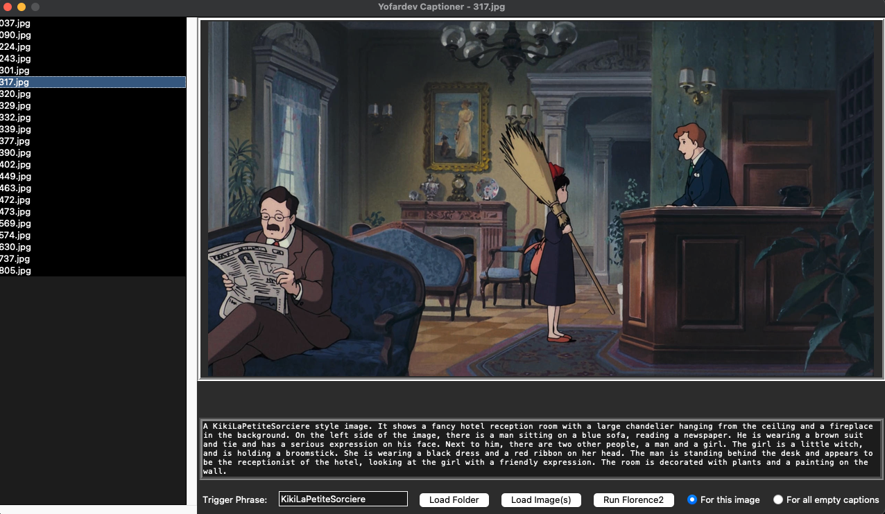

# Yofardev Captioner

Simple program to help write caption for images. Used [CaptionIMG](https://github.com/ANTONIOPSD/CaptionIMG) as a base for the project.

## Installation

> git clone https://github.com/YofarDev/Yofardev-Captioner.git

> cd Yofardev-Captioner

> python3 -m venv venv

> source venv/bin/activate

> pip install -r requirements.txt

## Usage

> python3 main.py
