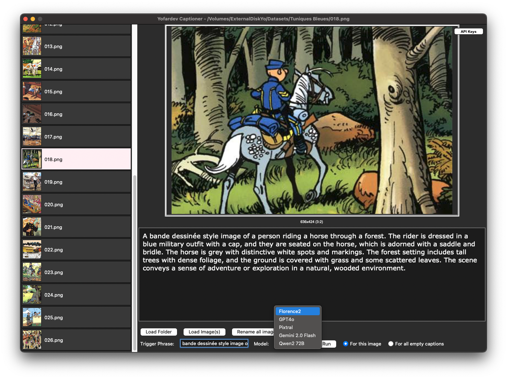

# Yofardev Captioner

Simple program to help write caption for images. With the help of vision models (currently : Florence2 localy, or GPT4o and Pixtral).



## Installation

> git clone https://github.com/YofarDev/Yofardev-Captioner.git

> cd Yofardev-Captioner

> python3 -m venv venv

> source venv/bin/activate

> pip install -r requirements.txt

## Usage

Create a .env file at the root of the project with the following content:

```
GITHUB_API_KEY=your-github-api-key
MISTRAL_API_KEY=your-mistral-api-key
GEMINI_API_KEY=your-gemini-api-key
```

Replace with your actual API keys.

Run the program:

> python3 main.py
