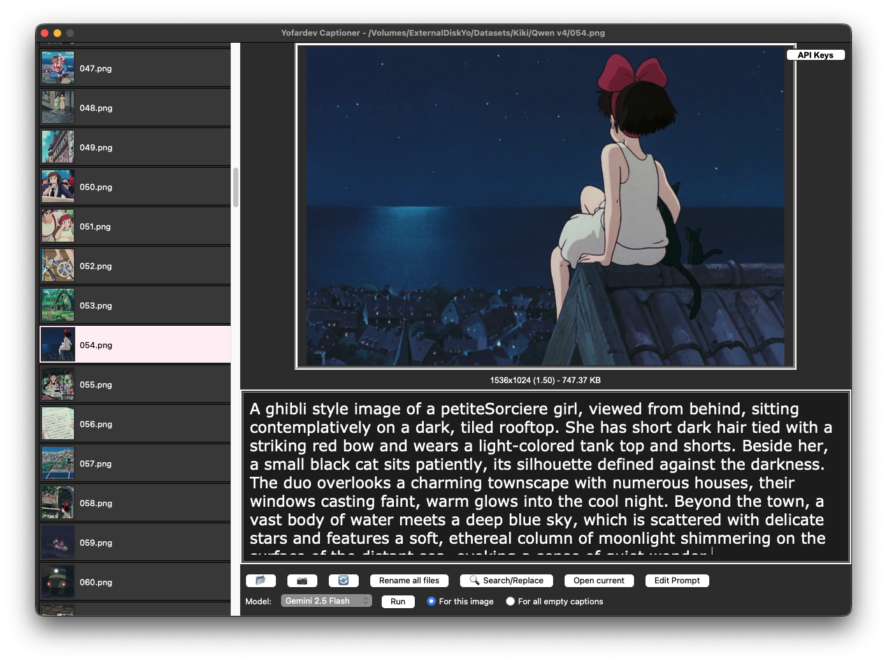

# Yofardev Captioner (Deprecated)
⚠️ This Python version is now deprecated.
The new and actively maintained version of Yofardev Captioner is built with Flutter and available here:
👉 https://github.com/YofarDev/yofardev_captioner_flutter

This repository contains the legacy Python version of Yofardev Captioner — a simple program designed to help generate captions for images using multiple vision models:

- Florence2
- GPT4o
- Pixtral
- Gemini 1.5 Flash
- Qwen2 72B

## Installation

> git clone https://github.com/YofarDev/Yofardev-Captioner.git

> cd Yofardev-Captioner

> python3 -m venv venv

> source venv/bin/activate

> pip install -r requirements.txt

## Usage

Run the program:

> python3 main.py
